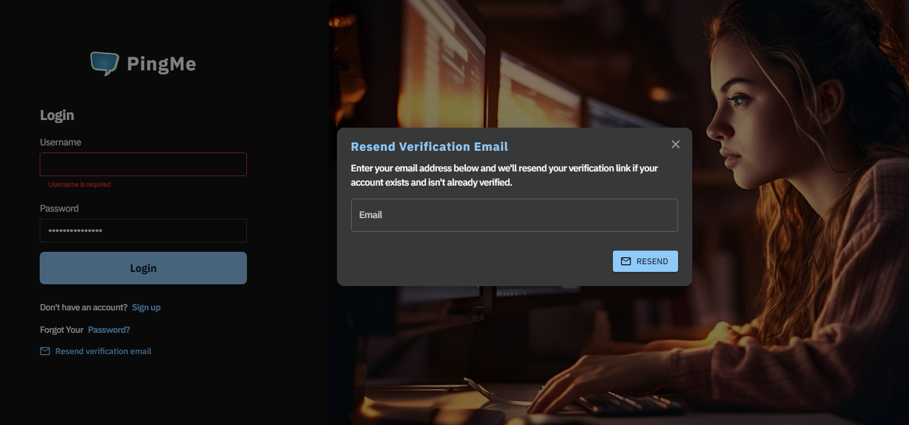
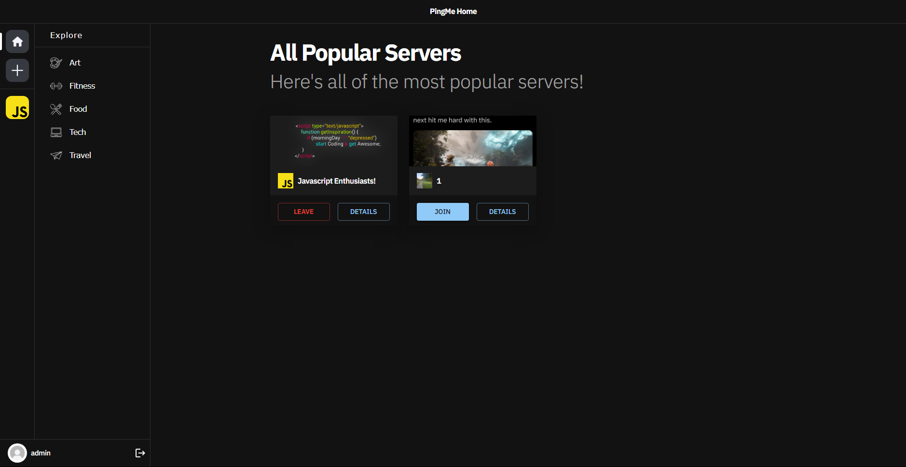
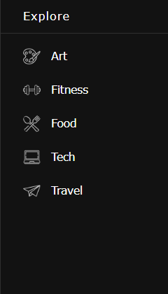
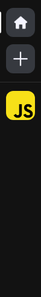

# PINGME

    

    Image generated using <a href="https://ui.dev/amiresponsive" target="_blank">https://ui.dev/amiresponsive</a>

## Project goals

Ping me is designed as a simple lightweight discord clone, where a user can signup and join or create community run servers, chat with other users and meet people!

1. Create the means to build and customize a own user account to establish an own identiy on the platform, join servers and chat with other users, so they ca n conenct make friends and find new hobbies
2. Deliver a simple UI that's easy to navigate and intiutive to the user
3. Offer a minimalistic yet practical suite of features with full crud functionality

This is the repository for the React frontend of PingMe
The project also utilises a Django Rest Framework web API, the repository for which is located [here](https://github.com/andy-guttridge/pingme_drf).

## Table of contents

<small><i><a href='http://ecotrust-canada.github.io/markdown-toc/'>Table of contents generated with markdown-toc</a></i></small>

## User stories

### Themes

### Epics

### User stories

User stories required to implement each epic were created. These were categorised according to whether they were 'must have' features required to implement a Minimum Viable Product (MVP).
Please see the [Google sheet](https://docs.google.com/spreadsheets/d/1jR_PG-xmP_mlyeGVrn_PkWYDqabUp-Sc03H3zo0RGiQ/edit?usp=sharing) for detail.

## Agile development methodology

GitHub issues and projects were used to document and track an agile development approach.
A GitHub issue was created for each user story, with labels to indicate if they were required, should have or optional, as well as this story points were assigned based onthe issue severity

A singular project board was used to track the overall app progress with both repositories being linked to it

The final project board can be found here [pingme GitHub Project Board](https://github.com/users/ShaAnder/projects/10).

## Planning

### Mockups

Wireframes were produced based on those user stories that had been identified as required for the MVP.
These wireframes are based on early design concepts of the site and how I implemented them.

    <a href="readme_assets/pp5_wireframes.pdf" target="_rel">Link to fullsize wireframes</a>

The wireframes were critical to the development of the site and were invaluable in terms of mapping and visualising the 'flow' through the site and the UI, as such they are extensively covered

### Data models

Data models were planned alongside the wireframes. These are documented in the backend Readme as well as the schema

## Design

### Colours

The apps primary design was set around the idea of a simplistic chat app and as I didn't want to create an overly vibrant tone that distracted from core usibility, as tehre are a lot of moving parts, I opted for a simple light and dark contrast that can be toggled through a light and dark mode in app. As well as secondary blues, purples and grays to compliment and give some pop to the app. These colors come from mui material in the form of primary, secondary and teriary color schemes

## Features

### Signin

This is our landing / starter page where the user can sign in to the app

    

### Registration form

The registration form enables a user to open a new account with the application platform, this has full email verification systems, the user in question will be sent a dedicated fully designed email with the ping me brand and they can opt to verify their email

    

### Other User Auth Forms

    

    

### Home Dashboard

Users will be directed to the home page upon login where they will get a list of all popular servers (by user count)

    

### Explore Tab & Category filter

The explore tab covers our different categories, these are currently admin set in the backend and cannot be changed as we don't want them to be a thing users can just add on the fly, a later feature implementation is going to be a suggestion form

The category pages are the same as the explore tab except it replaces the title for "People talking about "category"" and filteres the categories to match

    

### User Servers

These are the user servers be they generated or joined, they are displayed here for the user to click on and explore

    

### Add event and search buttons

Add Server form is displayed like so, i wanted to follow discords easy to use aesthetic a bit so when designing this i made the form straightforward and easy to understand
users will be prompted to enter all fields including the images by clicking the place holder image and can cancel the process at any time, and

### Calendar events detail displayed below calendar

_User stories 18, 19, 20, 22, 23 and 25_

When the user selects a day with events in the calendar, or performs a search with valid results, all relevant events are displayed in a list below the calendar (or to one side for large screens).

The events include an icon to represent the category of the event (like the stickers on a wall planner), the 'subject'/title of the event, avatars of the originating user and those who have been invited, the start and end dates and a further details 'collapsible' element to reveal who originated the event, who is invited to it and who has accepted the invitation.
The avatars of users who have not accepted the invitation a 'greyed out', while those who have accepted are coloured. If more than four users have been invited to an event, a circular avatar indicating the number of users over four (e.g. '+2' if there are six invited in total) is displayed.

If the current user is invited to an event, 'not going/going' buttons are shown to enable them to respond to the invitation.

    
    

### Edit event and delete event buttons

_User stories 22, 23 and 25_

Each calendar event can include an edit and delete button (visible in the screenshot above). These are only available for the user who originated the event, and the tribe admin (who has permission to edit and delete all of the family's events). Selecting the edit button opens the edit event form, and the delete button opens a modal dialog asking the user to confirm whether they wish to delete the event.

### Add event form

_User stories 14, 15, 16 and 17_

Selecting the add event button opens a form enabling the user to add a new calendar event. The form includes the following fields:

- To - a list of the other members of the user's tribe who can be invited to the event.
- Date and time - to select the start date and time of the event.
- Duration - to select the duration of the event. This is a dropdown list pre-populated with choices of 30 minutes, 1 hour, 90 minutes, 2 hours, 3 hours, 4 hours, 5 hours and 6 hours.
- Repeat - to allow the user to specify daily, weekly, two weekly, monthly or yearly recurrences.
- Subject - the subject or title of the event.
- Category - allows the user to select a category for the event from choices of Celebration, Club, Education, Medical, Music, Outing, Other, Pets, Shopping, Sport, Vacation, Work and None. The category determines the icon shown on the event.

The form also includes cancel and submit buttons.

    

### Edit event form

_User story 23_

The edit event form is identical to the add event form, but is pre-populated with the data for the relevant event, enabling the originator of the event or the tribe admin to edit the details and save to the database.

    

### Family contacts page

_User stories 30, 31, 32, 33 and 58_

The family contacts page displays a list of contacts for the family. These can be viewed by all members of the tribe, and only the tribe admin can add, edit or delete contacts.

    

### Add contacts and search contacts buttons

_User stories 30 and 58_

These two buttons are visible in the screenshot above. The add contact button is only visible to the tribe admin, and opens a form to add a new contact.
All members of the tribe can access the search contacts button, which opens a simple form to perform a text search on the contacts list.

### Add contact form

_User story 30_

The add contact form enables the tribe admin to add a new contact to the family's list.
It includes the following fields:

- Category - describes the nature or purpose of the contact, and is used as the heading for each contact in the contacts list. This is the only compulsory field on the form.
- Company - allows the tribe admin to record a company name, if relevant.
- Title - allows the tribe admin to record the title of a named contact, if relevant.
- First name - allows the tribe admin to record the first name of a named contact, if relevant.
- Last name - allows the tribe admin to record the last name of a name contact, if relevant.
- Telephone number - allows the tribe admin to record the phone number of a contact, if relevant.
- Email - allows the tribe admin to record the email address of a contact, if relevant.

The form also includes cancel and submit buttons.

    

### Search contacts form

_User story 58_

The search contacts form enables all members of the tribe to perform a simple text search of the contact list. All fields are matched against the search term by the API, and any results are shown underneath the form.

    

### Edit contact and delete contact buttons

_User stories 31 and 32_

Each contact can contain edit and delete buttons (visible in the screenshot above). These are only visible to the tribe admin.
The edit button opens the edit contact form, and the delete button opens a modal dialog asking the user to cancel or confirm the deletion.

### Edit contact form

_User story 31_

The edit contact form is identical to the add contact form, but is pre-populated with the data for the relevant contact and enables the tribe admin to make changes and save them to the database.

    

### Account page with My Tribe, My Profile, Change Password and Delete Account

_User stories 2, 8, 9 and 12_

The account page includes several sub-sections. For normal users these are My Profile, Change Password and Delete Account.
In addition, the tribe admin has the My Tribe section.

### My Tribe

_User stories 2 and 8_

This section includes a list of tribe members with their avatars, display name and a delete button, enabling the tribe admin to remove any members from the tribe and close their accounts. The delete button opens a modal dialog asking the user to cancel or confirm the action.

    

The My Tribe section includes an add tribe member button, which opens a form enabling the tribe admin to add new tribe members.
This requires entering a username and password (the new tribe member can change their own password later).

    

### My Profile

_User story 12_

This section enables the user to preview and upload a profile image, and change their display name. The display name is used to represent the user throughout the app (e.g. on calendar invitations), and when a new account is created this is set to the username, but can be freely changed.

    

### Change password

This enables the user to change their password. They are required to enter the new password twice to ensure a match, along with their old password - these fields are validated by the REST API to ensure the two new password fields match and that the old password is correct. An error alert is displayed if the form values do not pass validation.

    

### Delete account

_User story 9_

This section enables the user to delete their account. Selecting the button opens a modal dialog asking the user to cancel or confirm.
If the user confirms, their account is made inactive in the database, their profile deleted, and any events they have created are also deleted.

If the user deleting the account is the tribe admin, all user accounts associated with the tribe are made inactive, all their profiles deleted and all other data associated with the tribe is deleted. This action effectively 'shuts down' the whole tribe. Tribe admin users are presented with a specific warning of this above the delete button and in the modal.

    

### Modal dialogs to confirm or cancel destructive actions

All user actions that result in a permanent deletion of data trigger a modal dialog offering the opportunity to cancel or confirm.

    
    
    
    

### 'Single page mode' for medium and large screen sizes

Early in development, it became apparent that while the content and design of the web app was very well suited to mobile devices, each of the separate pages would appear very sparse on larger displays (e.g. tablet and desktop).
It was then decided to display the Tribe Home, Account and Profile pages as sections on a single page for screens of 768px width and above. The bottom navbar is not present when the app is in 'single page mode'. This was implemented using a custom `useSinglePage` hook, which any component within the app can access to determine whether the app is currently in single page mode and render itself appropriately.

For both tablets (768px breakpoint) and large devices (1024px breakpoint) calendar events are embedded in a scrolling div in order to avoid long lists of events above the Contacts and Account sections. This appears underneath the calendar for tablets, and to the right of the calendar for large devices.

pingme is very much a mobile first web app, and the experience for tablet and desktop users could be improved further (see the section on future features below).

    
    

### Prompts for new users

The Contacts and Account pages include prompts for tribe admins who have just opened an account to aid them with setting their tribe up.

    
    

### Success messages

The web app includes a series of success alerts to inform the user when a request resulting in a change (create, update or delete action) in the database has been successful.
There are no explicit success messages for accepting/declining invitations to events and deleting notifications, as it was felt this would be intrusive and detrimental to the user experience. The 'not going/going' buttons and the notifications badge provide visual feedback themselves, and the user will see an error message if an attempt to perform one of these actions fails.

    
    
    
    
    
    
    
    
    

### Error messages

pingme includes error alerts which are presented in the event a create, update or delete action fails (including data validation errors received from the REST API) and if there are any issues fetching data. A sample of error messages is shown below (these do not include every single permutation).

    
    
    
    

### Darkmode

The web app features a darkmode which is activated depending on the user's browser or system settings.

    
    
    

### Re-use of components

A number of reusable React components were created with the intention of reducing code duplication.

#### `Avatar.js`

Utilised to display user avatars in the `CalEvent.js` (displays calendar event details), `ProfileForm.js` (allows the user to preview and upload a new profile image) and `TribeMember.js` (used to display each tribe member in the My Tribe section) components.

It accepts `small` and `large` props which allow any other component which embeds it to request small or large versions (it renders itself in a medium size if neither of these props is present).

It also accepts an `accepted` prop with a `true` or `false` value - if it receives false the avatar is rendered in grey scale, otherwise in colour. This is used to provide visual indicator of whether a tribe member has accepted a calendar event in the `CalEvent.js` component. Finally, it also accepts a `displayName` prop which is used to provide an `alt` attribute for the image.

#### `ConfirmModal.js`

Used for the various cancel/confirm modal dialogs which are displayed when the user requests to perform a destructive action. Props it accepts include `heading` for the modal title; `body` for the modal body text; `cancelHandler` for handler function for the cancel button; and `confirmHandler` for a handler function for the confirm button.

#### `NotificationItem.js`

Used to render multiple instances of notifications in the notification menu. Props include `notification` for the notification details from the REST API; `notificationsChanged` and `setNotificationsChanged` which are used to toggle a boolean value to communicate to the parent component that the state of the notification has changed; `handleDeleteButton` for a handler function for the user deleting the notification and `notificationId` which is used to generate unique HTML `id` attributes for the buttons in the component and to communicate which notification has been deleted to the delete handler.

#### `Spinner.js`

Used to render the loading spinner utilised throughout the app. It accepts a `small` prop which a parent component can use to request a smaller spinner.

#### `Account.js`

Used for the main Account page in the mobile view, and also for the Account section in single page mode. It uses the `useSinglePage` custom hook to determine which CSS styles to use.

#### `TribeMember.js`

Multiple instances of this component represent tribe members in the My Tribe section of the Account page/section. It accepts `tribeMember` and `handleDeleteButton` props, which contain the details of the tribe member to be rendered and a handler for the delete button.

#### `Contacts.js`

Used for the main Contacts page in the mobile view, and for the Contacts section in single page mode. It uses the `useSinglePage` custom hook to determine which CSS styles to use.

#### `Contact.js`

Multiple instances of this component represent contacts in the Contacts page/section. It accepts props including `contact` for the details of the contact to render; `didSaveContact` and `setDidSaveContact` which toggle a boolean value to inform the parent component that a change to the state of the contact has taken place (e.g. it has been edited), `handleDeleteButton` which accept a handler for the user selecting the delete button for the specific contact; and `setActionSucceeded` which is used to set the value of a success alert message in the parent component.

#### `ContactDetailsForm.js`

Used for both the add contact and edit contact forms in the Contacts page/section. Props include `handleCancelButton` for a handler function; `didSaveContact` and `setDidSaveContact` which are used to inform the parent component that the state of a contact (if being edited as opposed to created) has changed; `isEditingContact` which the parent uses to tell the component whether it is being used to edit an existing contact or create a new one (this informs whether the form has to be populated with existing data, form submission behaviour and the title at the top of the form); `contact` for the details of the contact to be rendered and `setActionSucceeded` which is used to set the value of a success alert message in the parent.

#### `CalEvent.js`

Multiple instances represent calendar events in the Home page/section. It accepts props including `event` for the details of the event to be rendered; `didSaveEvent` and `setDidSaveEvent` which are used to inform the parent component that the state of an existing calendar event has changed; `handleDeleteButton` for delete button handler function; `calEventId` which is used to provide unique HTML id attribute values for buttons and other elements (the calendar event id from the API is unsuitable for this, as it may be shared between an original event and its recurrences, which may be displayed at the same time (e.g. in search results) and `setActionSucceeded` which is used to set the value of a success message alert in the parent component.

#### `EventDetailsForm.js`

Used for the add event and edit event forms in the Home page/section. Props include `handleCancelButton` for a handler function; `didSaveEvent` and `setDidSaveEvent` to inform the parent of a change to the state of the event if it has been edited; `isEditingEvent` which informs the component if it is being used to edit an existing event as opposed to create a new one (this affects whether the form needs to be populated with an existing event and form submission behaviour); `event` which contains details of the event being edited (if applicable); `defaultStartDate` which is used to populate the default form value for the start date of a new event (the parent passes in the current calendar day) and `setActionSucceeded` which sets the value of a success message alert in the parent.

### CRUD functionality

pingme features full Create, Read, Update and Delete functionality, via the UI implemented in React and the Django Rest Framework API.

- Create - users can register a new user account as a tribe administrator, and then create further user accounts for their tribe members. Tribe administrators can create contacts, and all authenticated users can create calendar events for their tribe.
- Read - authenticated users can view their tribe's contacts and calendar events, and their profile image and display name. Tribe administrators can also view a list of all their tribe members.
- Update - authenticated users can update their profile image, display name and password, and edit and save calendar events they have created. Additionally, tribe administrators can edit contacts and all calendar events for the tribe.
- Delete - authenticated users can delete calendar events they have created, and their user profiles. Tribe administrators can delete all calendar events, contacts, and user profiles.

### Future improvements and features

#### Short term future improvements

The following fixes and improvements would be made in the short term as a high priority if more time were available:

- Full synchronisation of state between components - currently if a user responds to an event via the notifications menu, this is not reflected in the calendar events list until the calendar data is reloaded from the server. Likewise, the notifications menu does not automatically refresh if an event is edited or added. This is because the notifications menu and calendar hold their own state and are separated from each other in the 'component tree'. Another similar issue is that if a user updates their display name or profile picture, this is not reflected in the welcome message in the header or in calendar events until the user refreshes the page. These issues could be resolved by refactoring the app so that as much state as possible (e.g. calendar events, notifications etc as well as profile data ) is held by top level context objects and ensuring that all components dependent on such state update themselves when there is a change, or by using a state management library such as Redux.
- Automatically display any events for the current day - currently the user has to select a day on the calendar to see any events when the page first loads, even if there are events for the current day.
- Refactoring to reduce the number of requests to the REST API - when the user selects a new month on the calendar, the React frontend requests events for 12 months either side of the current month, in order to 'buffer' the data and prevent a delay in data being displayed if the user skips a few months forwards or backwards. While this provides a relatively seamless user experience, it also means more data than necessary is being fetched in the background. This could be reduced by only fetching a full two years worth of data when the `TribeHome` component first mounts, and subsequently only loading one additional month at the 'extreme end of the range' each time the user changes month. Additionally, the `MyTribe` and `EventDetailsForm` components both separately fetch details of the current user's tribe from the API independently. Implementing a top level context object to fetch this data when the app first loads and make it available to the whole component tree could further reduce the number of data fetches.
- Password strength checking for all accounts - the custom Django Rest Framework code that enables tribe administrators to create additional user accounts for tribe members does not currently 'hook in' to Django's built-in checks for password strength.
- Reassign ownership of events created by deleted users - currently events are deleted if the user who created them deletes their account. This avoids any issues with 'orphaned' instances in the database, but a better solution would be to automatically or optionally transfer ownership of such events to the tribe administrator.
- Transfer of tribe admin status to another user - in the event a tribe administrator closes their account, all user accounts associated with the tribe are closed and data deleted. This is to prevent 'orphaned' tribes and tribe members with no administrator. A better solution would be to enable the transfer of tribe admin status to another user.
- All day calendar events.
- Improved event duration input - the current dropdown with a selection of pre-set duration values was chosen for speed of implementation. A more flexible means of selecting the durations would improve the user experience.
- A 'no reply' default event response status - currently each user can only have an 'accepted' or 'not accepted' status for each calendar event, with the default being 'not accepted'. This means that while users can actively accept an invitation, they cannot actively decline. This is acceptable for a first iteration of a minimum viable product, but a better user experience would be for the default status to be neutral, so that a user can either actively accept or decline.
- Improvements to 'single page mode' - the priority for the first iteration of pingme was to provide the best possible experience for mobile users, and while single page mode does take advantage of larger screen sizes, it is really still an expanded version of the mobile experience. A better tablet and desktop experience could be achieved by using a React library such as [Big Calendar](https://jquense.github.io/react-big-calendar/examples/?path=/story/about-big-calendar--page) to implement a larger 'outlook' style calendar where details of events are visible on the actual calendar itself. A modal or 'popover' type component would be implemented to present an additional layer of detail and to allow creation and editing of events.

#### Longer term future features

Lower priority, longer term features to be added are:

- Refactoring the events data format to adopt the iCal standard, as a first step towards implementing integration with external calendars such as Gmail etc.
- End dates/date ranges for repeat events (e.g. 'repeat weekly until 1 December 2023').
- Exceptions to repeat event rules (e.g. a user could set up an event to recur weekly every Wednesday, but could create an exception so that one recurrence is on a Thursday).
- Exceptions to 'accept/decline' responses for recurrences (e.g. the user could accept all recurrences and then decline them on an individual basis).
- Notifications to remind users of events ahead of time and push notifications.
- Day/week/year views for the calendar.
- Avatars for contacts.
- A 'banner image' for the whole tribe which can be set by the tribe admin. This would appear at the top of the page or as a background.
- Tribe colour themes which can be set by the tribe admin and/or colour themes which can be set by the user. This would be relatively straightforward to implement with TailwindCSS and daisyUI.
- Read/unread status for notifications - currently the notifications menu badge counts the number of notifications, and users can reduce the count only by deleting notifications. Flagging notifications as read or unread and giving the user the ability to mark each notification on an individual basis would be more in line with the behaviour of other apps/websites.
- Optionally adjusting calendar event dates and times to reflect the user's local timezone.
- Shopping lists and items, integrated with the calendar system.
- Meal plans, intregrated into shopping lists.
- UI improvements, e.g. an avatar based UI for inviting tribe members to events, and 'popovers' or 'callouts' for displaying calendar events.

Additionally, a native iOS app implementing the existing features in Swift and UIKit is planned (the Django Rest Framework API has been set-up to allow CORS requests from multiple domains with this in mind).

## Frameworks, libraries and dependencies

### React-Calendar

- [react-calendar](https://github.com/wojtekmaj/react-calendar) - this React library was used to implement the calendar. This is critical to the user experience as the calendar is a fundamental feature of the app, and creating such a calendar 'from scratch' would have been impractical within the time allowed for the project. React-Calendar was chosen because it is relatively lightweight and straightforward to use, enabling the key features to be implemented quickly, because it is compact in terms of its style, making it suitable for use on small mobile screens, and because it provides flexibility with respect to customisable CSS and calendar cell content (e.g. to enable the 'dots' used to indicate when there are events on a given day).

### React-Router-DOM

- [react-router-dom](https://www.npmjs.com/package/react-router-dom) - this library enables 'client side routing' for React web applications, and is used to implement basic routing in pingme, i.e. to implement the links on the bottom navbar, and register, sign-in and sign-out links. Using React-Router-DOM also enabled implementation of 'single page mode'to enhance the experience for users on larger screens. The `useSinglePage` custom hook is referenced in `App.js`, with different `Route` components conditionally rendered for the various paths depending on whether the app is running in single page mode. The `useLocation` hook from React-Router-DOM is used in some components to determine the current URL and respond accordingly, for example by ensuring the correct nav button is highlighted in the bottom navbar for mobile users.

### ReactDOM

- [react-dom](https://reactjs.org/docs/react-dom.html) - react-dom is used to manipulate the DOM outside of a specific component, and supports the user experience by enabling modal dialogs to be appended to the top level of the DOM (important for accessability) and alerts to be appended to specific components. For example, notifications are fetched by the NotificationsMenu component, but this takes the form of a dropdown menu, so using ReactDOM allows the component to 'reach out' into the DOM and display error alerts in a more obvious location than inside the dropdown.

### Axios

- [Axios](https://www.npmjs.com/package/axios) - the axios library was chosen to simplify making HTTP requests to the REST API (e.g. not having to manually configure HTTP headers), and because it enables simple implementation of 'interceptors' which are used to request a refresh token in the event of a HTTP 401 error. This enhances the user experience beacuse an authenticated user remains signed in for up to 24 hours, rather than having to sign in again after five minutes.

### JWT Decode

- [jwt-decode](https://www.npmjs.com/package/jwt-decode) - used to decode Base64URL encoded JSON web tokens.

### Tailwind CSS

- [TailwindCSS](https://tailwindcss.com/) - TailwindCSS was chosen partly in order to gain experience with an alternative to Bootstrap, and for its flexibility and quality of documentation.

### daisyUI

- [daisyUI](https://daisyui.com/) - this CSS component library is a TailwindCSS plugin, specifically chosen because of the 'bottom navigation' component which allowed quick implementation of a mobile-app style navbar at the bottom of the screen to provide a high quality mobile first user experience, and it's simple customisable colour theme functionality which enables a website to be built with a small number of colours represented by semantic CSS classes. This was well suited to pingme, which only requires a small number of colours with an emphasis on easy identification of UI elements. DaisyUI also supports specific dark mode themes, and although not a primary reason for choosing this library, the feature was utilised for an additional 'quick win' in terms of user experience.

### React Bootstrap Icons

- [React Bootstrap Icons](https://www.npmjs.com/package/react-bootstrap-icons) - this icon library was selected for the high quality and simplicity of the icons, and easy integration with React.

## React features used to enhance user experience

### Custom hooks

The `useSingle` page custom hook is used throughout the app so that components can check whether the app is currently running in 'single page' mode, and render themselves accordingly, for example by applying appropriate CSS classes for the 'mobile' versus 'single page' views. Many components are reliant on a `useCurrentUser` hook to determine whether the current user is authenticated, and to obtain various details about the user such as profile image, display name and whether they have tribe admin status.

## Testing

### Manual testing

Manual tests were devised for each user story to be implemented for the project.
These were performed on the final, deployed version of the site and are documented on the [pingme user stories spreadsheet](https://docs.google.com/spreadsheets/d/11wcDHeqr85VaHXdJjATod_WECRY03IRUlGgT_L_ikIw/edit#gid=0).

Several tests failed on the first attempt. In these cases, details of how the issues were addressed and the outcome of further testing are provided. All tests were passed after issues were resolved.

In addition, the site was deployed early and subject to continual user testing throughout the development process. This resulted in a number of enhancements to the user experience, which are documented in the user stories and planning sections above.

### Automated tests

Four automated tests were written for the `Header.js` component. These are in `src/components/__tests__/Header.test.js`.

The tests are as follows, and all passed:

- Test that the Header component renders with the logo text, and without a sign-out button when the user is not authenticated.
- Test that the Header renders a welcome message with the user's name when authenticated.
- Test that the Header renders a sign-out button for an authenticated user.
- Test that the Header does not render a welcome message or sign-out button after an authenticated user has pressed the sign-out button.

### Validator testing

### W3C CSS validator

All CSS files were passed through the W3C validator. The following errors and warnings were flagged:

- The TailwindCSS `@apply` directive was identified as a 'CSS hack' and in some cases as a 'parse error'. `@apply` is a directive provided by TailwindCSS that allows multiple utility classes to be applied to a single CSS class. This is particularly useful when working with existing libraries and components that do not themselves use Tailwind, and was essential for integrating `react-calendar` with Tailwind. It was also used to globally apply styles to specific HTML elements, for example Google Fonts are defined as Tailwind classes in `tailwind.config.js` and these classes are then applied globally to elements such as headings, paragraphs etc in `index.css`.

  These warnings and errors relating to `@apply` were flagged in `Calendar.module.css`, `Landing.module.css`, `TribeHome.css`. They were ignored as this is a valid TailwindCSS directive which generates valid CSS for the browser and is required to correctly style some components in pingme. Additionally, the TailwindCSS linter for VSCode flagged no errors for these.

- The `:global` selector which can be used in CSS modules to apply styles globally is not parsed by the W3C validator. This is used extensively in the `Calendar.module.css` file to override the default CSS classes defined in the library with Tailwind/daisyUI classes.

  These validator errors were ignored as `global:` is identified as valid syntax in the [CSS modules documentation](https://github.com/css-modules/css-modules) and is required to correctly apply CSS styles to the calendar.

- The `@tailwind` and `@layer` rules provided by TailwindCSS and used in the `index.css` file were flagged as errors. These were ignored as they are valid Tailwind syntax and not flagged as errors by the Tailwind linter.

- An invalid value of `scaleY(100%)` was used for the `transform` property in `ContactDetailsForm.module.css`, `ContactSearch.module.css`, `EventDetailsForm.module.css`, `EventSearch.module.css` and `TribeMemberDetailsForm.module.css`. This was corrected to `scaleY(1)` in each case.

- A warning that `skewY()` is a vendor extension was flagged in `Landing.css`. The MDN web docs reference for this CSS function identifies high browser compatibility, so this warning was ignored.

    

- Warnings about `-apple-system`, `-webkit-font-smoothing` and `-moz-osx-font-smoothing` vendor extensions were flagged in `index.css`. These were ignored as they are generated by the TailwindCSS installation and necessary for the library.

### ESLint JavaScript validator

All JavaScript files were validated using the ESLint JavaScript validator.
The following issues were identified and corrected:

- Unnecessary semi-colons at the end of some statements.
- Unescaped apostrophies in HTML text in some components.
- An unused variable.
- Missing React import statements.

### WAVE web accessability testing

Testing with the WAVE validation revealed the following issues:

- Contrast issues with buttons. The text colour for buttons in the primary and secondary colour was lightened, while outline buttons were changed from primary to a dark (or light for dark mode) colour, and the font size was increased for all buttons. This successfully resolved the issues.

- Contrast issues were also detected between the dots on the calendar indicating where there are events for a given day. This was more difficult to address, because the calendar cells can have a number of different colours depending on their current state. After some experimentation, the `mix-blend-mode` attribute with a value of `difference` was used on these elements to invert their colour against that of the background. This means the colour of these indicators might not fit as well with the colour scheme of the site, but it eliminates the contrast issues.

- Three further contrast errors were found, but these were ignored as they apply to hidden elements which provide additional information for screen readers.

- Avatar images throughout the website had the same text for the alt attribute. This was addressed by passing a `displayName` prop through to the Avatar component, and using this to generate an appropriate alt text value for each user.

- Several form elements with no label were flagged on the profile update form and the event search form (caused by missing or incorrect id attributes on input elements), and one element with a duplicate id on the contacts form (caused by a naming clash with another element on the add event form).

- The label containing the notifications indicator was found to contain no text. This was rectified by putting a `` element with the Tailwind CSS `sr-only` class inside the label, providing a read out of the number of notifications present for screen readers but visually hidden. This label was also flagged as orphaned from its form control by the Wave validator, however this was not fixed, as the label is used instead of a button for the DaisyUI dropdown component in order to overcome a bug in Safari.

- Missing labels were found for the input elements which are part of the DaisyUI collapse components used to reveal further detail for each calendar event. This was rectified by passing the unique key value generated for each CalEvent instance as a `calEventId` prop, using this to generate a unique id for each input and associating a screen reader only label to each one.

- The Wave report contained an alert about the `noscript` element. This was to flag that content within this element must be accessible. Since the element contains a simple text reminder that JavaScript must be enabled to use the website, this was deemed not to be an issue.

- Skipped heading levels in the notification items menu and on calendar events were identified. The former was addressed by changing the `h3` elements used in the `NotificationItem` component to `h2` and styling to look like `h3`. The headings for event titles on calendar events were changed from `h4` to `h3`, which would appear to be correct as the next heading above them is an `h2`, however this did not resolve the validator error. `h2` and `h1` were also tested for these headings, but this still did not resolve the error. These elements were then changed to `p` and the error was resolved. The `h5` headings within the 'details' collapse component at the bottom of calendar events were also changed to `p` elements to resolve similar errors.

- Category icons on calendar events did not have unique text for the `alt` attribute. This was due to a bug rather than an oversight, and was corrected. Wave then flagged a 'redundant alternative text' alert, meaning that another nearby element had an image with the same `alt` text. This is because more than one event in the list of events had the 'shopping' category - given the purpose and meaning of the icon, a repeat occurence of the alt text is correct and was deemed not to be an issue.

### Lighthouse testing

Lighthouse testing was undertaken in incognito mode for every URL for mobile and in single page mode, in both light and dark modes, and on the landing page, sign-in page and registration page. Each page/section was tested with add, edit and search forms and modal dialogs open.

WAVE validation had already been completed and most accessability issues fixed, however lighthouse did reveal that button elements did not have id attributes, which are required by assistive technologies.

After this issue had been addressed, every page achieved 100% for accessability.
All pages achieved 100% for best practices, except for the landing, registration and sign-in pages, where HTTP 401 errors in the console reduced the score to 92%. This is expected as a consequence of a non-authenticated user being redirected away from content requiring authorisation.

Performance scores were not as high, ranging from a low of 61% for the contacts page with the search form being opened on mobile to 90% for the app in single page mode with the add tribe member form being opened. Performance scores for the majority of pages/scenarios ranged from the low 70s to high 80s. The same potential performance improvements were identified in each case:

- Serve images in next gen formats.
- Reduce unused JavaScript.
- Eliminate render-blocking resources (e.g. deliver critical JavaScript and CSS inline).
- Minify JavaScript.
- Efficiently encode images.
- Preload larges contentful paint image.
- Serve static assets with efficient cache policy.
- Avoid chaining critical requests.
- Use user timing marks and measures.
- Keep request counts low and transfer sizes small.
- Avoid large layout shifts.
- Avoid long main-thread tasks.

The hero image on the landing page was compressed in order to improve loading time. The other potential improvements could be implemented in a future iteration.

    Lowest lighthouse score: contacts page with search form open, mobile: 
     
    

    Typical lighthouse score: tribe home page with add events form open, mobile: 
     
    

    Highest lighthouse score: single page mode with add tribe member form open, desktop: 
     
    

### Resolved bugs

- During implementation of the `NotificationItem` component, requests to the REST API for the data for the events with which each notification is associated were frequently resulting in an HTTP 500 internal server error. A version of the API running on a development server was used for debugging. This revealed that the number of simultaneous requests for data coming from a large number of NotificationItems was overwhelming the free tier ElephantSQL database server. The fix was to add the full data for each event to the notification JSON served by the API, which meant that only one network request was required to fetch the notification and event data together.
- During testing, a large amount of empty space was noted at the bottom of each page, but only for some user accounts. No elements causing this could be identified using the Chrome developer tools, and elements were manually removed from each component until the culprit was found. This revealed that the unordered list of notifications inside the DaisyUI dropdown component used for the notifications menu was taking up vertical space in the document even when closed/not visible. This was only noticeable for users with a large number of notifications and hence a very long list inside the menu. The issue was addressed by applying the Tailwind CSS hidden class to the unordered list when not visible. An event listener was added to detect clicks outside of the menu and close the list accordingly.
- After search functionality had been added, it became apparent that edits to events and event deletions made from events in the search results were not reflected in the calendar. This was fixed by passing `childDidSaveEvent` and `setChildDidSaveEvent` props down through the component tree to `EventSearch.js` component, through to the `CalEvent.js` component and on to the `EventDetailsForm.js` component, to trigger the calendar to reload it's data after a change has been made. This was a 'quick fix' to correct the bug, and would be a candidate for refactoring in future.

### Unresolved bugs

- Users accessing pingme from iOS devices, Safari on MacOS, Samsung Internet on Samsung devices and possibly others must turn off 'Prevent Cross Site Tracking' (Apple devices), 'Smart Anti-Tracking' (Samsung devices) or other similar features in order to use the web app. This is because the Django Rest Framework API and the React front-end are hosted on separate domains using Heroku, and cross-domain requests from the front-end to the API are blocked by these anti-tracking features. It appears there is no solution to this, other than to host the API and front-end on the same domain (reference - https://stackoverflow.com/questions/56972162/is-there-a-workaround-for-safari-ios-prevent-cross-site-tracking-option-when).

## Deployment

To deploy to Heroku, follow these steps:

- Fork or clone this repository in GitHub.
- If you have also cloned and deployed your own version of the pingme Django Rest Framework API, you will need to ensure the value of `axios.defaults.baseURL` in `src/api/axiosDefaults.js` is set to the base URL for your API. Pull to your local development environment and push back to GitHub if necessary; otherwise, leave as is to use the original pingme API.
- Log in to Heroku.
- Select 'Create new app' from the 'New' menu at the top right.
- Enter a name for the app and select the appropriate region.
- Select 'Create app'.
- Select the 'Deploy' tab at the top.
- Select 'GitHub' from the deployment method options to confirm you wish to deploy using GitHub. You may be asked to enter your GitHub password.
- Find the 'Connect to GitHub' section and use the search box to locate your repo.
- Select 'Connect' when found.
- Optionally choose the main branch under 'Automatic Deploys' and select 'Enable Automatic Deploys' if you wish your deployed site to be automatically redeployed every time you push changes to GitHub.
- Find the 'Manual Deploy' section, choose 'main' as the branch to deploy and select 'Deploy Branch'.

When deployment is complete, you will be given a link to the deployed site.

## Credits

### Code

- How to use the React Router `<BrowserRouter>` component to provide history context to `<Router>` components is from [this Stack Overflow article](https://stackoverflow.com/questions/65425884/react-router-v6-error-useroutes-may-be-used-only-in-the-context-of-a-route)
- The technique to use an event handler to store the current size of the window in state variables in order to conditionally render components was adapted from [this Stack Overflow question](https://stackoverflow.com/questions/62954765/how-to-do-conditional-rendering-according-to-screen-width-in-react)
- Code to handle current user context in `src/contexts/CurrentUserContext.js` was adapted from Code Institute 'Moments' React walkthrough lessons
- Code to create and use axios interceptors to refresh tokens in `src/contexts/CurrentUserContext.js` and `src/utils/utils.js` was adapted from the Code Institute 'Moments' React walkthrough lessons
- The technique to add modal dialogs to the end of the body element in the DOM is from [upmostly.com](https://upmostly.com/tutorials/modal-components-react-custom-hooks)
- How to use the `:global` selector in CSS to ensure styles are overriden in a React component is from [Stack Overflow](https://stackoverflow.com/questions/42191671/css-modules-reactjs-parent-and-child-css-classes-in-different-components)
- How to use `require` to ensure webpack processes local images is from [Stack Overflow](https://stackoverflow.com/questions/34582405/react-wont-load-local-images)
- How to use CSS filters to colour a SVG is from [Stack Overflow](https://stackoverflow.com/questions/22252472/how-can-i-change-the-color-of-an-svg-element)
- How to define a CSS class as part of a DaisyUI theme is from [GitHub](https://github.com/saadeghi/daisyui/discussions/640)
- How to iterate over the keys of a JavaScript object in React is from [Stack Overflow](https://stackoverflow.com/questions/40803828/how-can-i-map-through-an-object-in-reactjs)
- The technique for handling multiple selection elements in controlled React forms is from [Stack Overflow](https://stackoverflow.com/questions/50090335/how-handle-multiple-select-form-in-reactjs)
- How to correctly use the useCallback hook to declare a function outside of useEffect and call from inside useEffect to enable code reuse is from [Stack Overflow](https://stackoverflow.com/questions/56410369/can-i-call-separate-function-in-useeffect)
- How to add a number of minutes to a DateTime object is from [StackOverflow](https://stackoverflow.com/questions/1197928/how-to-add-30-minutes-to-a-javascript-date-object)
- The technique for using a timer to prevent excessive network requests when the values of input elements on a search form change is from the Code Institute Moments walkthrough project
- How to redirect to an appropriate page when the user enters an invalid URL using the Navigate component from React-Router-DOM has been adapted from [copycat.dev](https://www.copycat.dev/blog/react-router-redirect/)
- How to use Google Fonts in a Tailwind CSS project is from [daily-dev-tips.com](https://daily-dev-tips.com/posts/using-google-fonts-in-a-tailwind-project/)
- How to invert the colour of an element compared to its background is from [Stack Overflow](https://stackoverflow.com/questions/17741629/how-can-i-invert-color-using-css)
- How to create divs with diagonal lines is from [9elements.com](https://9elements.com/blog/pure-css-diagonal-layouts/)
- How to use the text-shadow CSS attribute to add an outline to text is from [Stack Overflow](https://stackoverflow.com/questions/57464935/font-outline-using-only-css)
- How to configure JEST to allow tests with Axios v1 and above is from [Stack Overflow](https://stackoverflow.com/questions/74940474/jest-encountered-an-unexpected-token)

The following documentation was referenced extensively throughout the project:

- [React documentation](https://react.dev/reference/react)
- [React Router Documentation](https://v5.reactrouter.com/)
- [TailwindCSS documentation](https://tailwindcss.com/docs/)
- [DaisyUI documentation](https://daisyui.com/components/)

### Media

- Placeholder screenshots image used on the wireframes by u_fg0tkeqgiy on [Pixabay](https://pixabay.com/vectors/view-web-secure-image-ipad-laptop-7321141/).
- Hero image used on the landing page by Pexels on [Pixabay](https://pixabay.com/photos/child-couple-daylight-family-1844901/).
- Placeholder avatar image used on the wireframes and in the app by Stephanie Edwards on [Pixabay](https://pixabay.com/vectors/blank-profile-picture-mystery-man-973460/).
- Fidget spinner image used for loading spinner by b0red on [Pixabay](https://pixabay.com/vectors/fidget-spinner-add-a-d-spin-2304681/)
- Images used for event category icons:
  - Club icon used for club by Clker-Free-Vector-Images on [Pixabay](https://pixabay.com/vectors/clubs-cards-club-shape-card-games-33561/)
  - Mortar board icon used for education Clker-Free-Vector-Images on [Pixabay](https://pixabay.com/vectors/graduation-cap-graduation-education-311979/)
  - Medical bag icon used for medical by OpenClipart-Vectors on [Pixabay](https://pixabay.com/vectors/red-cross-aide-assistance-158454/)
  - Musical note icon used for music by ruhbastard on [Pixabay](https://pixabay.com/vectors/music-note-music-note-musical-notes-1967480/)
  - Metallic O icon used for other by Clker-Free-Vector-Images on [Pixabay](https://pixabay.com/vectors/english-alphabets-o-letters-15th-33793/)
  - Shopping trolley icon used for shopping by Clker-Free-Vector-Images on [Pixabay](https://pixabay.com/vectors/shopping-cart-caddy-shopping-trolley-304843/)
  - Volley ball icon used for sport by Clker-Free-Vector-Images on [Pixabay](https://pixabay.com/vectors/volleyball-sport-black-white-306791/)
  - Aeroplane icon used for vacation by GDj on [Pixabay](https://pixabay.com/vectors/jumbo-jet-airplane-aeroplane-1801305/)
  - Office desk icon used for work by OpenClipart-Vectors on [Pixabay](https://pixabay.com/vectors/computer-office-worker-typing-146329/)
  - Present icon used for celebration by chachaoriginal on [Pixabay](https://pixabay.com/vectors/red-icon-present-gift-wrapped-1902863/)
  - Car icon used for outing by Clker-Free-Vector-Images on [Pixabay](https://pixabay.com/vectors/car-automobile-sedan-four-door-car-35502/)
  - Cat icon used for pets by Lohrelei on [Pixabay](https://pixabay.com/vectors/cat-kitten-sitting-silhouette-1144200/)
- Fonts:
  - [Google Fonts Fredoka One](https://fonts.google.com/?query=fredoka+one&sort=popularity)
  - [Google Fonts Nunito](https://fonts.google.com/specimen/Nunito?query=nunito&sort=popularity)
  - [Google Fonts Lato](https://fonts.google.com/?query=lato&sort=popularity)
