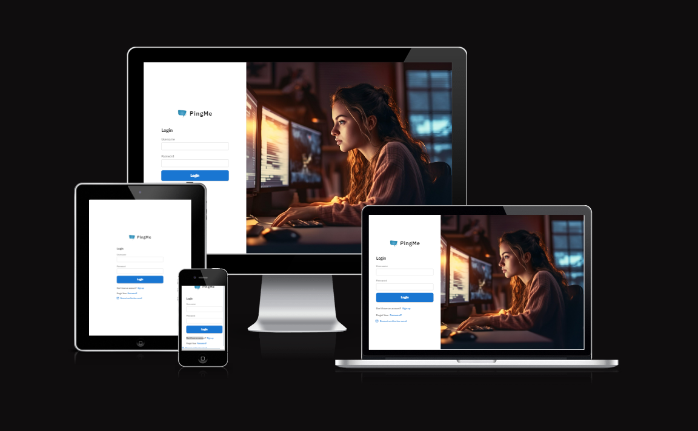
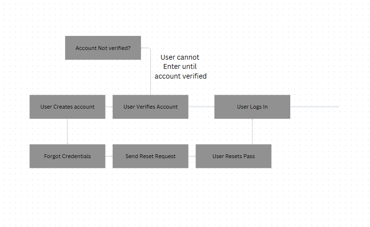
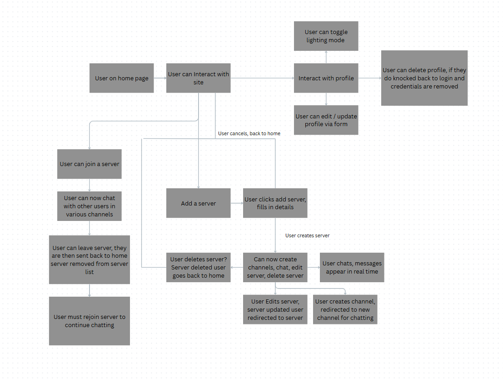
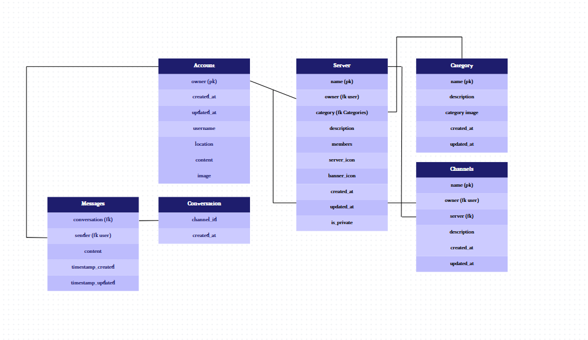
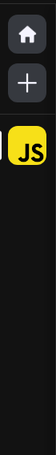

# PINGME

Portfolio 5 project as part of the Diploma in Full Stack Software Development by Code Institute.

---

Ping me is a lightweight discord clone that allows the user to view signup and join chatrooms to chat with other users, the sole aim of the project is to document my skills with react/typescript mui and django rest framework

Visit the delployed site! - [PingMe!](https://ping-me-pp5-frontend-c34a5313765d.herokuapp.com)

## CONTENTS

- [PingMe](#ping-me)
  - [CONTENTS](#contents)
  - [Site Objectives](#site-objectives)
- [User Experience/UX](#user-experienceux)
  - [Target Audience](#target-audience)
  - [User Stories](#user-stories)
    - [New Visitor Goals](#new-visitor-goals)
    - [Existing Visitor Goals](#existing-visitor-goals)
- [Design Choices](#design-choices)
  - [Colour Scheme](#colour-scheme)
  - [Typography](#typography)
  - [Logo and Favicon](#logo-and-favicon)
  - [Wireframes](#wireframes)
  - [Flow Diagram](#flow-diagram)
  - [Database Plan](#database-plan)
- [Features](#features)
- [Agile Methodology](#agile-methodology)
- [Reusability And React](#reusability-and-react)
- [Testing](#testing)
- [Future Features](#future-features)
- [Technologies Used](#technologies-used)
- [Programming Languages, Frameworks and Libraries Used](#programming-languages-frameworks-and-libraries-used)
- [Deployment](#deployment)
- [Credits](#credits)
- [Media](#media)
- [Acknowledgments and Thanks](#acknowledgments-and-thanks)

---

## Site Objectives

This site was designed with multiple major objectives in mind, mainly to capitalize on my react knowledge, learn mui and typescript as well as build on my django rest framwork knowledge

The main objectives were:

- ### Create a readable, clean and responsive and minimalistic front end

I wanted to make the site visually appealling site that allowed the user to quickly navigate with simplicity and ease as well as keeping it as uncluttered as possible

- ### Take full advantage of backend functionality

Django is a fantastic tool, and the capabilities it brings to a fullstack app like this are unrivaled, so i knew i needed it in this project, add onto that websockets and channels allwoed me to create a truly amazing realtime chat application

- ### Store data on an external cloud database

WE used cloudinary for avatar hosting, a code institute db for the models and heroku for the app hosting

---

# User Experience/UX

## Target Audience

- A simple chat app where users can signup, find similar hobbies to chat about and join those chat rooms

## User Stories

### New Visitor Goals

- To understand what the site and content is about.
- How to navigate the site.
- Use the site to find people to talk to and hopefully also new hobbies

### Existing Visitor Goals

- Log in and out of their account.
- Have full crud functionality of their account and recommendations
- Be able to contribute to the site by adding servers / meeting people and fostering communities

---

# Design Choices

## Colour Scheme

I opted for a sleek and minimalist colorset with a dark palette of grays and blues to create a sleek and modern looking site, i also leveraged muis themes and inversion to create a really simple yet comprehensive light and dark mode color switch

## Typography

The main fonts were used to make the text pop just enough while also not being too distracting

## Logo and Favicon

The logo was created using an online logo creator - [Brandcrowd](https://www.brandcrowd.com/)
Additonally I used a lot of icons in the page design, these were all added using muis icons

## Wireframes

wireframes were all created with mobile in mind, as thanks to muis drawer and media query system desktop was automatically rendered without the need
to build huge media query css files

## Flow Diagram

As this was a larger application, i split it into two flows, and the erd while simple here can be covered more in depth in the backend erd

(this is a dumbed down version of the erd, a more comprehensive look can be found in the backend readme)

# Features

Below you can see all the features present in this app

The main landing page so to speak, users will be directed here if they need to login / they are unauthorized to do so
from the login page they have access to creating an account, resetting their password and resending verification emails

As a user expects to be able to edit their details and account the app comes with full crud functionality on the profile
allowing a user to create edit and delete their account should they so choose

This is where the use can go and explore the various server categories on offer to find new places to check out

The server list is the main bar on the left of the app, this hosts all the users servers and allows them to selecte
which server to go into at any time

The app is powered behind the scenes by forms that allow the user to edit and add to it in various ways, this is thanks
to a formik integrated form component designed by me that takes custom input fields

This is where users can chat with each other, the app hosts a backend redis powered websocket connector that sends and
broadcasts messages in real time

Much like the form the app utilizes a custom modal to give users clear visual feedback whenever they need it.

## Agile Methodology

As this app was created with agile principles in mind a full project board was setup to acommodate the application, inside here you can find user stories created on a ranking MVP system with story points attached to dictate importance, as well as this a kanban was created to trach started, finished and discard features

You can view it [here](https://github.com/users/ShaAnder/projects/10)

## Reusability and React

As this app was created with typescript react, I put a strict adhereance to DRY and reusability as well as using context to ensure a smooth flowing application that was easily scalable and maintainable, I also leveraged pages and templates to create MULTIPLE screens / views without having to build several full webpages a comprehensive list of the resuable components can be found below:

### Form

The [Form](src/components/shared/Form.tsx)

This generic React form component, written in TypeScript, enables you to dynamically render and manage forms based on a configurable schema. Here’s how it works:

- Field Schema and Props: You define the form fields using an array of Field objects, each specifying properties like name, label, type, and additional options (such as select choices or file accept types). The Form component receives these fields, initial values, a validation function, and a submission handler as props.
- Formik Integration: The component leverages Formik for form state management, validation, and submission. This means all form values, errors, and submission state are handled in a predictable, type-safe way.
- Dynamic Rendering: The form iterates over the fields array and renders each field appropriately. For file/image fields, it displays an avatar preview and handles file input with a preview using the FileReader API. For other field types (text, password, email, etc.), it uses Material UI’s TextField with error handling and helper text.
- Customization and Accessibility: The form supports disabling fields, showing loading states (with a spinner on the submit button), and adding custom footers. It also ensures accessibility by associating labels and inputs.
- Type Safety: By using TypeScript generics, the form enforces type safety for initial values, validation, and submission, reducing runtime errors and improving developer experience.

In summary, this component allowed you to create robust, reusable forms in React by simply providing a schema and logic, handling all the rendering, validation, and state management for you.

### Modal

The [Modal](src/components/shared/Modal.tsx)

This Modal component is a reusable, stylized wrapper around Material UI’s Dialog, designed for displaying dialogs, popups, or modals in your React application. Here’s how it operates:

The component accepts all standard DialogProps (except title), plus custom props:

- open: Controls whether the modal is visible.
- onClose: Callback to close the modal.
- title: Optional string for the modal’s header.
- children: The modal’s main content.
- actions: Optional React node for footer actions (e.g., buttons).

Theming and Styling:
Uses useTheme to inherit your app’s color palette. The modal is styled with a high z-index to always appear above other elements, rounded corners, and custom background/text colors.

If a title is provided, it’s rendered in a prominent, styled DialogTitle. An always-present close (X) button sits in the top-right, calling onClose when clicked.

- The children prop is rendered inside DialogContent.
- If actions are provided, they appear in a right-aligned DialogActions footer.

The close button is accessible via aria-label="close".

### Contexts / Hooks / Services

I built every API call in this app to act like a context wrapper so that i could simultaneously leverage getting the data from teh server and defensive programming / efficient loading

The context came in three parts (example userAuth);

A Service Provider - This acted as our heavy lifter doing all the api calls, our api functions and wrapping in the app
The Context - This housed our actual context and prop type fikes
The Hook - This was our actual hook that our components could all to consume the context and get the data

I found this setup to be uniquely ideal and allowed us to have an efficient modular system

### Templates

Using MUI materials drawer, themes and rapid development and building systems the main pages were built out as templates to hold the content and ensure responsive design, built to accept react components as children allowing us to build out our platform and use the same layout consistently, we could effectively build a plug and play system where the (for example) [home](src/pages/Home.tsx) used the exact same layout as the [server](src/pages/Server.tsx) but we just plugged in different components and had an entirely different page

There are more examples of reusable components in the [shared](src/components/shared) folder

## Testing

Full testing can be found in the testing.md file linked [here](https://github.com/ShaAnder/Ping_Me_Frontend/blob/main/TESTING.md)

## Future Features

- member lists on servers
- Friend lists and dming
- Invites to servers with a code
- Friend moderation
- Kicking users out of servers
- Viewing memeber profiles
- Category recommendations

I also want to work on code optimization and better stylistic choices, this is an app i loved making and want to work more on

## Features Not Included

- I wanted to try and get advanced filtering as well as filter resetting but couldn't in this iteration
- Eventually id also like to add more varied category filters as well as more details to a user account
- Originally I wanted to allow image and video uploads but that task was beyond the scope of this build

---

# Technologies Used

Here are the technologies used to build this project:

- [Vs code](https://codeanywhere.com/) To build and create this project
- [Github](https://github.com) To host and store the data for the site.
- [PEP8 Validator](https://pep8ci.herokuapp.com/) Used to check python code for errors
- [HTML & CSS Validator](https://jigsaw.w3.org/css-validator/) for html and css validation
- [ElephandSQL](https://www.elephantsql.com/) Used to store PostgreSQL database.
- [Cloudinary](https://cloudinary.com/) Used as cloud storage for images uploaded as part of the blog posts
- [Heroku](https://id.heroku.com/) Used to deploy the project

# Programming Languages, Frameworks and Libraries Used

- [HTML](https://developer.mozilla.org/en-US/docs/Web/HTML)
- [CSS](https://developer.mozilla.org/en-US/docs/Learn/Getting_started_with_the_web/CSS_basics)
- [Python](<https://en.wikipedia.org/wiki/Python_(programming_language)>)
- [Django](https://www.djangoproject.com/)
- [MUI Material](https://mui.com)
- [React](https://react.dev)
- [Typescript](https://www.typescriptlang.org)

---

## Deployment

### Github Deployment

The website was stored using GitHub for storage of data and version control. To do this I did the following;

After each addition, change or removal of code, in the vscode terminal (or whatever your ide is) type:

- git add .
- git commit -m "meaningful commit message"
- git push

The files are now available to view within your github repository.

### Creating a Fork or Copying

To clone/fork/copy the repository you click on the fork tab which is situated next to unwatch tab in the top right corner of the page

### Clone

To create a clone you do the following;

1. Click on the code tab, left of the Gitpod tab
2. To the right of the repository name, click the clipboard icon
3. In the IED open GitBash
4. Change the working directory to the location you prefer
5. Add Git Clone with the copy of the repository name
6. Clone has been created

### Repository deployment via Heroku

- On the [Heroku Dashboard](https://dashboard.heroku.com) page, click New and then select Create New App from the drop-down menu.
- When the next page loads insert the App name and Choose a region. Then click 'Create app'
- In the settings tab click on Reveal Config Vars and add the following vars (you may need to get some api keys)

1. Cloudinary URL
2. Postgres Database URL
3. GOOGLE MAPS API Key
4. HOST EMAIL
5. HOST PW
6. Port (8000)
7. IP
8. SECRET KEY

### Deployment of the app

- Click on the Deploy tab and select Github-Connect to Github.
- Enter the repository name and click Search.
- Choose the repository that holds the correct files and click Connect.
- A choice is offered between manual or automatic deployment whereby the app is updated when changes are pushed to GitHub.
- Once the deployment method has been chosen the app will be built and can be launched by clicking the Open app button which should appear below the build information window, alternatively, there is another button located in the top right of the page.

---

## Credits

This project was actually based on a conversation I had with a friend about never being able to find good places to go locally or even what was around, so i figured why not build an app to do it!

I watch a lot of code related content and i used a lot of tutorials on how to build django apps from them. videos from people like [Mosh](https://www.youtube.com/watch?v=rHux0gMZ3Eg) really helped me progress my knowledge, sadly i still have a long way to go, especially when it comes to working with js and django, but this has been an amazing opportunity for learning and growth!

The Readme layout was based on the example by [Kera Cudmore - Readme Examples](https://github.com/kera-cudmore/readme-examples/blob/main/README.md?plain=1)

The wireframe mockups were created using [Figma](https://https://www.figma.com/)

Once complete, the readme file was passed through a spelling and grammar check via [Grammarly](https://www.grammarly.com/)

---

## Media

For placeholder images such as the avatar i used a default avatar i made and other images came from [pexels](https://www.pexels.com/search/travel/) which provides a library of stock images that display as a placeholder. Many thanks to those artists

All other content and images are my own.

---

## Acknowledgments and Thanks

Very academy from udemy for hosting a very well structured course that got me started with mui and typescript

Perplexity for being able to help me understand some of the most annoyingly written docs in a long time

And my friends maki and alex, who honestly if i wasn't able to sit and chat to them while working id probably have gone insane by now :smile:

For help with manual testing:

- Various friends and family, and whatever random stranger didn't tell me to go away immediately
